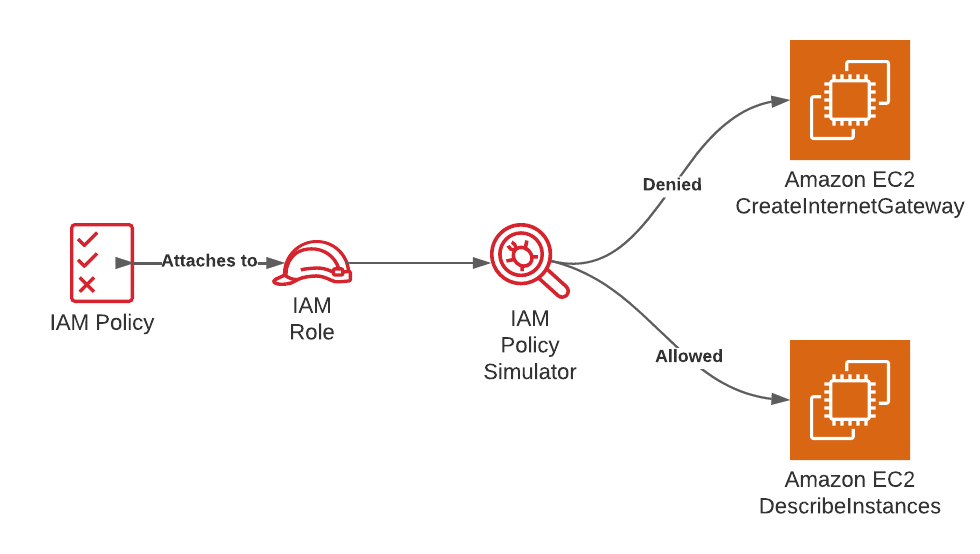

# Testing IAM Policies with the IAM Policy Simulator

## Problem
You have an IAM policy that you would  like to put into use but would like to test its effectiveness first.

## Solution
Attach an IAM policy to an IAM role and simulate actions with the IAM Policy Simulator, as shown in Figure 1-6.



## Step

1. Create a file called assume-role-policy.json with the following content (file provided in the repository):
```
{
  "Version": "2012-10-17",
  "Statement": [
    {
      "Effect": "Allow",
      "Principal": {
        "Service": "ec2.amazonaws.com"
      },
      "Action": "sts:AssumeRole"
    }
  ]
}
```

2. Create an IAM role using the assume-role-policy.json file:
```
aws iam create-role --assume-role-policy-document \
     file://assume-role-policy.json --role-name AWSCookbook104IamRole
```

You should see output similar to the following:
```
{
  "Role": {
  "Path": "/",
  "RoleName": "AWSCookbook104IamRole",
  "RoleId": "<<UniqueID>>",
  "Arn": "arn:aws:iam::111111111111:role/AWSCookbook104IamRole",
  "CreateDate": "2021-09-22T23:37:44+00:00",
  "AssumeRolePolicyDocument": {
    "Version": "2012-10-17",
    "Statement": [
    ...
```

3. Attach the IAM managed policy for `AmazonEC2ReadOnlyAccess` to the IAM role:
```
aws iam attach-role-policy --role-name AWSCookbook104IamRole \
     --policy-arn arn:aws:iam::aws:policy/AmazonEC2ReadOnlyAccess
```

> Tip: You can find a list of all the actions, resources, and condition keys for EC2 in this AWS [article](https://docs.aws.amazon.com/service-authorization/latest/reference/list_amazonec2.html#amazonec2-actions-as-permissions). The IAM [global condition context keys](https://docs.aws.amazon.com/IAM/latest/UserGuide/reference_policies_condition-keys.html) are also useful in authoring fine-grained policies.

### Validation checks
Simulate the effect of the IAM policy you are using, testing several different types of actions on the EC2 service.

Test the `ec2:CreateInternetGateway` action:
```
aws iam simulate-principal-policy \
     --policy-source-arn arn:aws:iam::$AWS_ACCOUNT_ID:role/AWSCookbook104IamRole \
     --action-names ec2:CreateInternetGateway
```

You should see output similar to the following (note the `EvalDecision`):
```
{
  "EvaluationResults": [
  {
    "EvalActionName": "ec2:CreateInternetGateway",
    "EvalResourceName": "*",
    "EvalDecision": "implicitDeny",
    "MatchedStatements": [],
    "MissingContextValues": []
  }
  ]
}
```

> Note: Since you attached only the AWS managed `AmazonEC2ReadOnlyAccess` IAM policy to the role in this recipe, you will see an implicit deny for the `CreateInternetGateway` action. This is expected behavior. `AmazonEC2ReadOnlyAccess` does not grant any “create” capabilities for the EC2 service.

Test the `ec2:DescribeInstances` action:
```
aws iam simulate-principal-policy \
     --policy-source-arn arn:aws:iam::$AWS_ACCOUNT_ID:role/AWSCookbook104IamRole \
     --action-names ec2:DescribeInstances
```

You should see output similar to the following:
```
{
  "EvaluationResults": [
  {
    "EvalActionName": "ec2:DescribeInstances",
    "EvalResourceName": "*",
    "EvalDecision": "allowed",
    "MatchedStatements": [
      {
      "SourcePolicyId": "AmazonEC2ReadOnlyAccess",
      "SourcePolicyType": "IAM Policy",
      "StartPosition": {
        "Line": 3,
        "Column": 17
      },
      "EndPosition": {
        "Line": 8,
        "Column": 6
      }
      }
    ],
    "MissingContextValues": []
  }
  ]
}
```

> Note: The `AmazonEC2ReadOnlyAccess` policy allows read operations on the EC2 service, so the `DescribeInstances` operation succeeds when you simulate this action.

## Clean up 
### Step Text
Detach the AmazonEC2ReadOnlyAccess policy from the role:
```
aws iam detach-role-policy --role-name AWSCookbook104IamRole \
--policy-arn arn:aws:iam::aws:policy/AmazonEC2ReadOnlyAccess
```

Delete the IAM Role for the proxy: 

```
aws iam delete-role --role-name AWSCookbook104IamRole
```

## Discussion
[IAM policies](https://docs.aws.amazon.com/IAM/latest/UserGuide/access_policies.html) let you define permissions for managing access in AWS. Policies can be attached to principals that allow you to grant (or deny) permissions to resources, users, groups and services. It is always best to scope your policies to the minimal set of permissions required as a security best practice. The [IAM Policy Simulator](https://docs.aws.amazon.com/IAM/latest/UserGuide/access_policies_testing-policies.html) can be extremely helpful when designing and managing your own IAM policies for least-privileged access.

The IAM Policy Simulator also exposes a web interface you can use to test and troubleshoot IAM policies and understand their net effect with the policy you define. You can test all the policies or a subset of policies that you have attached to users, groups, and roles.

> Tip: The IAM Policy Simulator can help you simulate the effect of the following:
> * Identity-based policies
> * IAM permissions boundaries
> * AWS Organizations service control policies (SCPs)
> * Resource-based policies

After you review the Policy Simulator results, you can add additional statements to your policies that either solve your issue (from a troubleshooting standpoint) or attach newly created policies to users, groups, and roles with the confidence that the net effect of the policy was what you intended.

> Note: To help you easily build IAM policies from scratch, AWS provides the [AWS Policy Generator](https://awspolicygen.s3.amazonaws.com/policygen.html).

### Challenge
Simulate the effect of a permissions boundary on an IAM principal (see [Recipe 1.5](https://github.com/AWSCookbook/Security/tree/main/105-Delegating-IAM-Administrative-Capabilities-Using-Permissions-Boundaries)).
