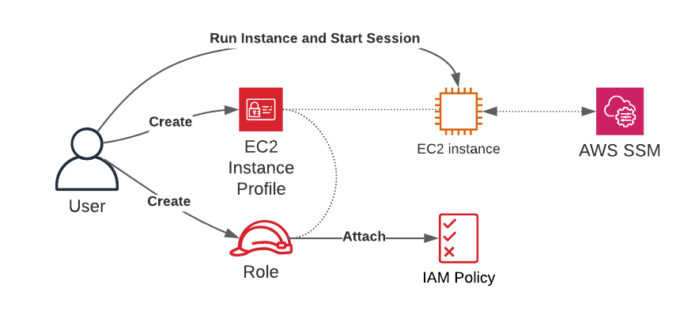

# Connecting to EC2 Instances Using AWS SSM Session Manager

## Problem
You have an EC2 instance in a private subnet and need to connect to the instance without using SSH over the internet. 

## Solution
Create an IAM role, attach the `AmazonSSMManagedInstanceCore` policy, create an EC2 instance profile, attach the IAM role you created to the instance profile, associate the EC2 instance profile to an EC2 instance, and finally, run the `aws ssm start-session` command to connect to the instance. A logical flow of these steps is shown in Figure 1-8.



### Prerequisites
* Amazon Virtual Private Cloud (VPC) with isolated or private subnets and associated route tables
* [Required VPC endpoints for AWS Systems Manager](https://aws.amazon.com/premiumsupport/knowledge-center/ec2-systems-manager-vpc-endpoints/)
* AWS CLI v2 with the [Session Manager plugin installed](https://docs.aws.amazon.com/systems-manager/latest/userguide/session-manager-working-with-install-plugin.html)

## Preparation
### This recipe requires some “prep work” which deploys resources that you’ll build the solution on. You will use the AWS CDK to deploy these resources 

### In the root of this Chapter’s repo cd to the “106-Connecting-to-EC2-Instances-Using-Session-Manager/cdk-AWS-Cookbook-106/” directory and follow the subsequent steps: 

```
cd 106-Connecting-to-EC2-Instances-Using-Session-Manager/cdk-AWS-Cookbook-106/
test -d .venv || python3 -m venv .venv
source .venv/bin/activate
pip install --upgrade pip
pip install -r requirements.txt
cdk deploy
```

### Wait for the cdk deploy command to complete. 

### We created a helper.py script to let you easily create and export environment variables to make subsequent commands easier. Run the script, and copy the output to your terminal to export variables:

`python helper.py`

### Navigate up to the main directory for this recipe (out of the “cdk-AWS-Cookbook-106” directory):

```
cd ..
```


## Steps
1. Create a file named assume-role-policy.json with the following content (file provided in the repository):
```
{
  "Version": "2012-10-17",
  "Statement": [
  {
    "Effect": "Allow",
    "Principal": {
      "Service": "ec2.amazonaws.com"
    },
    "Action": "sts:AssumeRole"
  }
  ]
}
```

2. Create an IAM role with the statement in the provided assume-role-policy.json file using this command:
```
ROLE_ARN=$(aws iam create-role --role-name AWSCookbook106SSMRole \
     --assume-role-policy-document file://assume-role-policy.json \
     --output text --query Role.Arn)
   eiifccrckjintdrfblkfefnkifdfuufilcjjdhnlbrj
```

3. Attach the AmazonSSMManagedInstanceCore managed policy to the role so that the role allows access to AWS Systems Manager:
```
aws iam attach-role-policy --role-name AWSCookbook106SSMRole \
     --policy-arn arn:aws:iam::aws:policy/AmazonSSMManagedInstanceCore
```

4. Create an instance profile:
```
aws iam create-instance-profile \
     --instance-profile-name AWSCookbook106InstanceProfile
```
You should see output similar to the following:
```
{
  "InstanceProfile": {
    "Path": "/",
    "InstanceProfileName": "AWSCookbook106InstanceProfile",
    "InstanceProfileId": "(RandomString",
    "Arn": "arn:aws:iam::111111111111:instance-profile/AWSCookbook106InstanceProfile",
    "CreateDate": "2021-11-28T20:26:23+00:00",
    "Roles": []
  }
}
```

5. Add the role that you created to the instance profile:
```
aws iam add-role-to-instance-profile \
     --role-name AWSCookbook106SSMRole \
     --instance-profile-name AWSCookbook106InstanceProfile
```
>NOTE: The EC2 instance profile contains a role that you create. The instance profile association with an instance allows it to define “who I am,” and the role defines “what I am permitted to do.” Both are required by IAM to allow an EC2 instance to communicate with other AWS services using the IAM service. You can get a list of instance profiles in your account by running the `aws iam list-instance-profiles` AWS CLI command.

6. Query SSM for the latest Amazon Linux 2 AMI ID available in your Region and save it as an environment variable:
```
AMI_ID=$(aws ssm get-parameters --names \
     /aws/service/ami-amazon-linux-latest/amzn2-ami-hvm-x86_64-gp2 \
     --query 'Parameters[0].[Value]' --output text)
```

7. Launch an instance in one of your subnets that references the instance profile you created and also uses a `Name` tag that helps you identify the instance in the console:
```
INSTANCE_ID=$(aws ec2 run-instances --image-id $AMI_ID \
     --count 1 \
     --instance-type t3.nano \
     --iam-instance-profile Name=AWSCookbook106InstanceProfile \
     --subnet-id $SUBNET_1 \
     --security-group-ids $INSTANCE_SG \
     --metadata-options \
HttpTokens=required,HttpPutResponseHopLimit=64,HttpEndpoint=enabled \
     --tag-specifications \
     'ResourceType=instance,Tags=[{Key=Name,Value=AWSCookbook106}]' \
     'ResourceType=volume,Tags=[{Key=Name,Value=AWSCookbook106}]' \
     --query Instances[0].InstanceId \
     --output text)
```
> TIP: [EC2 instance metadata](https://docs.aws.amazon.com/AWSEC2/latest/UserGuide/ec2-instance-metadata.html) is a feature you can use within your EC2 instance to access information about your EC2 instance over an HTTP endpoint from the instance itself. This is helpful for scripting and automation via [user data](https://docs.aws.amazon.com/AWSEC2/latest/UserGuide/instancedata-add-user-data.html). You should always use the latest version of instance metadata. In step 7, you did this by specifying the `--metadata-options` flag and providing the `HttpTokens=required` option that forces [IMDSv2](https://docs.aws.amazon.com/AWSEC2/latest/UserGuide/configuring-instance-metadata-service.html).

## Validation checks
Ensure your EC2 instance has registered with SSM. Use the following command to check the status. This command should return the instance ID:
```
aws ssm describe-instance-information \
     --filters Key=ResourceType,Values=EC2Instance \
     --query "InstanceInformationList[].InstanceId" --output text
```
Connect to the EC2 instance by using SSM Session Manager:
```
aws ssm start-session --target $INSTANCE_ID
```
You should now be connected to your instance and see a bash prompt. From the bash prompt, run a command to validate you are connected to your EC2 instance by querying the metadata service for an IMDSv2 token and using the token to query metadata for the instance profile associated with the instance:
```
TOKEN=`curl -X PUT "http://169.254.169.254/latest/api/token" -H "X-aws-ec2-metadata-token-ttl-seconds: 21600"`
curl -H "X-aws-ec2-metadata-token: $TOKEN" http://169.254.169.254/latest/meta-data/iam/info
```
You should see output similar to the following:
```
{
  "Code" : "Success",
  "LastUpdated" : "2021-09-23T16:03:25Z",
  "InstanceProfileArn" : "arn:aws:iam::111111111111:instance-profile/AWSCookbook106InstanceProfile",
  "InstanceProfileId" : "AIPAZVTINAMEXAMPLE"
}
```
Exit the Session Manager session:
```
exit
```
## Clean up 

### Terminate the EC2 Instance:

```
aws ec2 terminate-instances --instance-ids $INSTANCE_ID
```

### Detach the policy from the role:

```
aws iam detach-role-policy --role-name AWSCookbook106SSMRole --policy-arn arn:aws:iam::aws:policy/AmazonSSMManagedInstanceCore
```

### Remove the role from the instance profile:

```
aws iam remove-role-from-instance-profile --instance-profile-name AWSCookbook106InstanceProfile --role-name AWSCookbook106SSMRole
```

### Delete the instance profile:

```
aws iam delete-instance-profile --instance-profile-name AWSCookbook106InstanceProfile
```

### Delete the role:

```
aws iam delete-role --role-name AWSCookbook106SSMRole
```

### Go to the cdk-AWS-Cookbook-106 directory:

```
cd cdk-AWS-Cookbook-106/
```

### To clean up the environment variables, run the helper.py script in this recipe’s cdk- directory with the --unset flag, and copy the output to your terminal to export variables:

```
python helper.py --unset
```

### Unset your manually created environment variables:

```
unset ROLE_ARN
unset AMI_ID
unset INSTANCE_ID
```

### Use the AWS CDK to destroy the resources, deactivate your Python virtual environment, and go to the root of the chapter:

```
cdk destroy && deactivate && rm -r .venv/ && cd ../..
```

## Discussion
When you use AWS SSM Session Manager to connect to EC2 instances, you eliminate your dependency on Secure Shell (SSH) over the internet for command-line access to your instances. Once you configure Session Manager for your instances, you can instantly connect to a bash shell session on Linux or a PowerShell session for Windows systems.

> WARNING: SSM can log all commands and their output during a session. You can set a preference to stop the logging of sensitive data (e.g., passwords) with this command: `stty -echo; read passwd; stty echo;` There is more information in an [AWS article](https://docs.aws.amazon.com/systems-manager/latest/userguide/session-manager-logging.html) about logging session activity.

Session Manager works by communicating with the AWS Systems Manager (SSM) API endpoints within the AWS Region you are using over HTTPS (TCP port 443). The agent on your instance registers with the SSM service at boot time. No inbound security group rules are needed for Session Manager functionality. We recommend configuring [VPC Endpoints for Session Manager](https://www.youtube.com/watch?v=cjSuHarpQJg) to avoid the need for internet traffic and the cost of Network Address Translation (NAT) gateways.

Here are some examples of the increased security posture Session Manager provides:
* No internet-facing TCP ports need to be allowed in security groups associated with instances.
* You can run instances in private (or isolated) subnets without exposing them directly to the internet and still access them for management duties.
* There is no need to create, associate, and manage SSH keys with instances.
* There is no need to manage user accounts and passwords on instances.
* You can delegate access to manage EC2 instances using IAM roles.

> NOTE: Any tool like SSM that provides such powerful capabilities must be carefully audited. AWS provides information about [locking down permissions](https://docs.aws.amazon.com/systems-manager/latest/userguide/session-manager-getting-started-ssm-user-permissions.html) for the SSM user, and more information about [auditing session activity](https://docs.aws.amazon.com/systems-manager/latest/userguide/session-manager-auditing.html).

### Challenge
View the logs for a session and create an alert whenever the rm command is executed.
